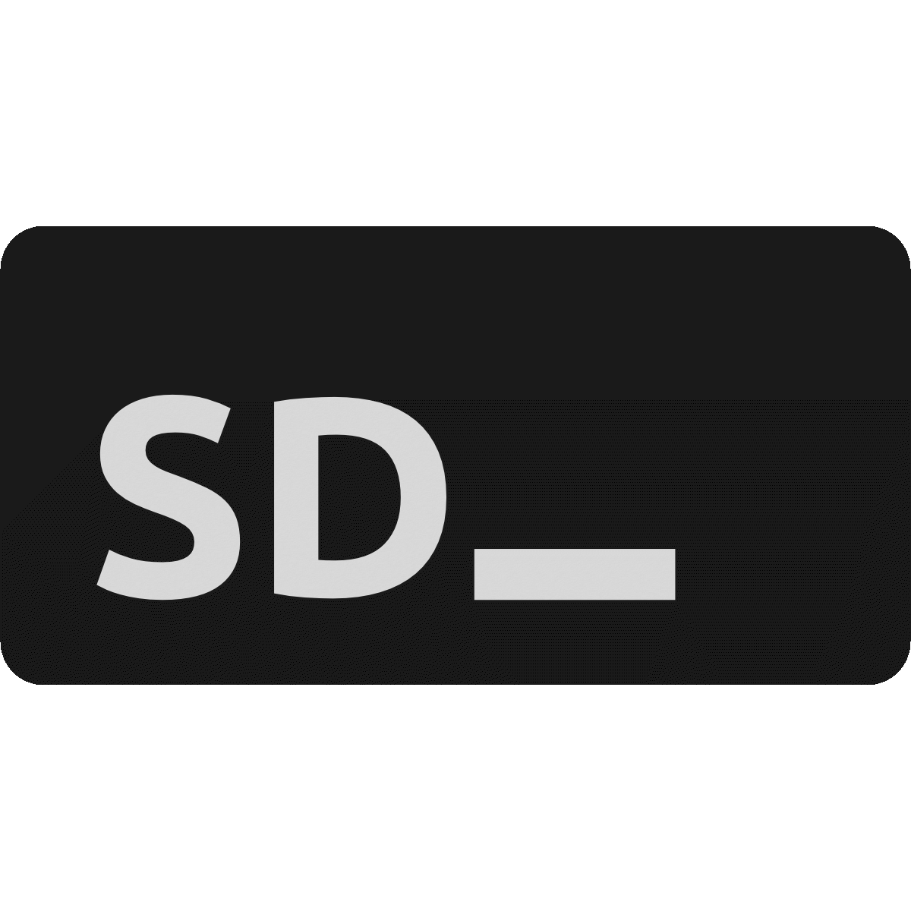

## About **Skripdown**
**Skripdown** is a simple **Markdown** language designed for fast end thesis writing with feature such as autoformat,
autogenerate and simplified syntax. **Skripdown** just require less than a second to parse text into **Markup** object.
With simply, expressive and intuitive syntax made **Skripdown** so powerfull to deal with thesis writing.

## **Skripdown** v0.2 Feature
- Auto Format
- Auto Emphasis
- AutoSave Editor
- Live Preview Content
- Thesis Management

## Learning **Skripdown**
**Skripdown** syntax is almost just like other **Markdown** language but has thesis structure adapted. You can check out the [documentation](https://laravel.com/docs) to learn more.

## **Skripdown** Donor
We would like to extend our thank to the following names for funding **Skripown** development. If you are interested in funding this project or contributing with your great skill, feel free to contact me on [instagram](https://instagram.com/malkolp).

## Funder
- **Rina** (Rina Fachriani Putri)
- **Ica** (Veronica Fachriani Putri)
- **Erwin** (Erwin Fachriani)
- **Fransiska** (Fransiska Tan)
- **Melky** (Syamsul Rizal)
- **Fathir** (Fathir Fakriansyah)
- **Wahyu** (Wahyu Hadi Saptura)
- **8-ball** (Ahmad Iqbal Harianto)
- **Inna** (Aldina Fariza)
- **Dea** (Rahmah Fadilah)

## Users
Thank you for using **Skripdown**!
We are so happy that we can help university student to finish their thesis.
We will be very thankful for all the feedbacks.

## Bugs
If you found some bugs inside **Skripdown**, feel free to report that.

## License
**Skripdown** is open-sourced software licensed under the [MIT license](https://opensource.org/licenses/MIT).
